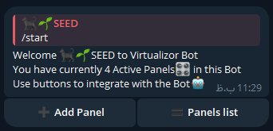
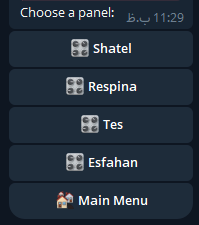
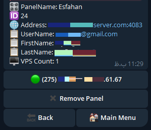
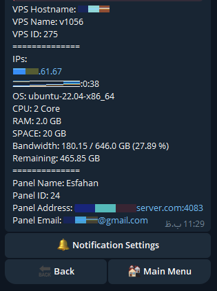
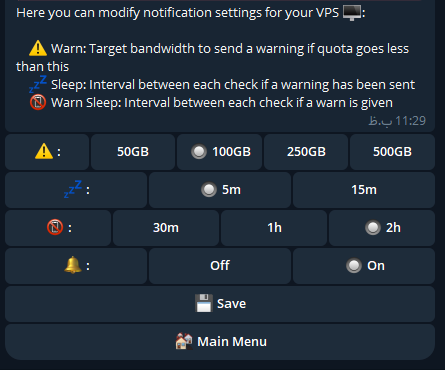

# VirtualizorPanel
Multiple Virtualizor Panel and VPS Manager with Bandwidth Checker and Notifier option under TelegramBot

| Feature  | Supported |
|-----|:-----:|
| Adding Unlimited Panels  |  ✅  |
| Adding Unlimited VPSs  |  ✅  |
| Fully VPS-Level Customizable |  ✅  |
| Real-Time Info Update  |  ✅  |
| Free & Easy to Use  |  ✅  |

# Screenshots
<p align="center">
  
  <br>
  
  
  <br>
  
  
</p>


# What you need

## Telegram Bot
To make a telegram bot:
1. start the BotFather in telegram: https://t.me/BotFather
2. Create a bot, BotFather will send you its api_token, Save it!

## Virtualizor Info
### API Access
To gain api access of your Virtualizor account:
1. Login to your account and click on your username on the top and then click on "API Credentials"
2. On the "Create API Credentials" tab, click on "Create API Key Pair"
3. Back on "List API Credentials" tab, you can see generated "API Key" and "API Password", Save it!

### Virtualizor Panel IP
The IP address of your Virtualizor Panel IP given to you by the administrator, Usualy ends with 4083 port!

# Install
Linux:
You can use Install script to do these actions.
```bash
bash <(curl -Ls https://raw.githubusercontent.com/Ashaxer/VirtualizorPanel/main/install.sh)
```

or you can install manually:
## Clone the project:
```bash
cd
git clone https://github.com/Ashaxer/VirtualizorPanel
cd VirtualizorPanel
```
Windows: simply download the project as zip and extract it in a folder

## Config the config.env file:
Linux:
```bash
nano config.env
```
after finishing, Press Ctrl + S to save and then Ctrl + X to exit the editor.


Windows: use notepad or notepad++ or other text-editing tools and edit the db.json file.

### Variables:
Insert your Telegram api_token in front of TELEGRAM_BOT_TOKEN
(Optional)Insert your Proxy info needed for connecting to Telegram servers

## Install requirements
You need to have python and requests on your machine:
Linux:
```bash
apt-get update -y
apt-get upgrade -y
apt-get install python3
apt-get install python3-pip
pip install -r requirements.txt
```

Windows:
Download and install latest python from https://Python.org

after installing python, open the extracted folder and type "cmd" on your address bar and hit Enter

in Command Prompt window, enter following command:
```cmd
python -m pip install -r requirements.txt
```

# Run the script
Linux:
```bash
python3 telegrambot.py
```
alternatively you can install Screen package on your machine and use it to check the logs and prevent closing the proccess:
```bash
apt install screen
screen -dmS VirtualizorPanel sh -c 'cd /root/VirtualizorPanel/ && /usr/bin/python3 telegrambot.py'
```
to Enter the screen:
```bash
screen -r VirtualizorPanel
```
to Detach from screen, Press Ctrl + A + D keys simultaneously.

Although you can set this command to run every startup using following line:
```bash
{ crontab -l -u root; echo "@reboot /bin/bash screen -dmS VirtualizorPanel sh -c 'cd /root/VirtualizorPanel/ && /usr/bin/python3 telegrambot.py' >/dev/null 2>&1"; } | crontab -u root -
```

Windows:
Double click the telegrambot.py file...?

# Update
Linux:
You can use update script to do these actions.
```bash
bash <(curl -Ls https://raw.githubusercontent.com/Ashaxer/VirtualizorPanel/main/update.sh)
```

or you can update it manually:
to achieve that, simply backup these two files somewhere:
database.pkl, config.env

Linux:
```bash
mkdir /var/tmp/VP-Backup
cp /root/VirtualizorPanel/config.env /var/tmp/VP-Backup/config.env
cp /root/VirtualizorPanel/database.pkl /var/tmp/VP-Backup/database.pkl
```

Windows:
Go to the application folder and copy database.pkl and config.env files somewhere else.


To update, close the application and remove it's folder and follow the Install process again
```bash
screen -XS VirtualizorPanel quit
pkill -f "telegrambot.py"

cd
rm -rf /root/VirtualizorPanel
git clone https://github.com/Ashaxer/VirtualizorPanel
cd VirtualizorPanel
```

after reinstalling the program, restore the backedup files and rerun the application:
Linux:
```bash
cp /var/tmp/VP-Backup/config.env /root/VirtualizorPanel/config.env
cp /var/tmp/VP-Backup/database.pkl /root/VirtualizorPanel/database.pkl
screen -dmS VirtualizorPanel sh -c 'cd /root/VirtualizorPanel/ && /usr/bin/python3 telegrambot.py'
```

Windows:
Copy database.pkl and config.env files (which you backed up earlier) into the extracted application folder and run the "telegrambot.py" file
